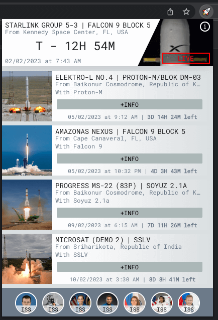

# Rocket-Launch-Schedule

This is a [Chrome Plugin](https://chrome.google.com/webstore/detail/ijabdkefnohiaibcmbfihcjkjamffoph/) & [Firefox addon](https://addons.mozilla.org/en-US/firefox/addon/rocket-launch-schedule/) that allows you to display the schedule of the upcoming rocket launches.



## How to install

The fast way to get the app is to install it from the proper markets:

+ Firefox: [addons.mozilla.org](https://addons.mozilla.org/en-US/firefox/addon/rocket-launch-schedule/)
+ Chrome: [chrome.google.com](https://chrome.google.com/webstore/detail/ijabdkefnohiaibcmbfihcjkjamffoph/)

## Dev Environment

The main javsacript files and under the `/js` directory. But the app uses the compiled `/app.js`. To build this file you can do `gulp js`.

1. Install NPM deps:
```bash
npm i
```
2. Compule `js` files:
```bash
gulp watch
```
3. Make your changes;
4. Open `/popup.html` to view your changes.

## Contributing

This project is only possible because of your help.
If you find any bug please report it at [issues](https://github.com/mariogarridopt/Rocket-Launch-Schedule/issues).

[How to make a contribution](CONTRIBUTING.md)

### License

This project is available under the [GPL-3.0 license](LICENSE).
